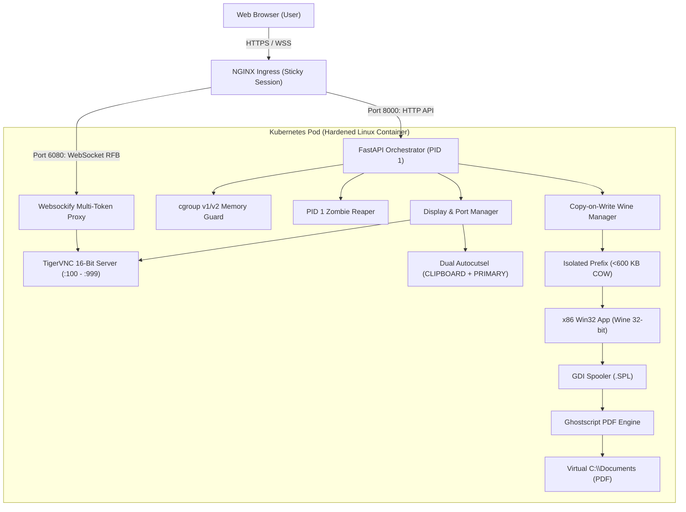

# win32-vnc-k8s

[](https://github.com/asyntec/win32-vnc-k8s/actions/workflows/ci.yml)
[](https://github.com/asyntec/win32-vnc-k8s/actions/workflows/security.yml)
[](https://opensource.org/licenses/Apache-2.0)
[](https://www.python.org/)
[](https://www.bestpractices.dev/en/projects/14467)

> **High-density x86 Windows application runtime with HTML5 VNC streaming for Linux containers and Kubernetes (AKS, EKS, GKE, K8s).**

---

## 1. Overview

Enterprise organizations frequently maintain mission-critical legacy 32-bit Windows (x86) desktop applications (built in Delphi, C++ Builder, Visual Basic 6, or MFC) that cannot easily be rewritten or replaced. Migrating these workloads to modern cloud infrastructure like Azure Kubernetes Service (AKS), AWS EKS, or Docker typically runs into notorious roadblocks:

1. **Storage and Memory Bloat:** Standard Wine installations require 1.5 GB to 3.0 GB of disk space per user profile, rendering multi-tenant pod hosting cost-prohibitive.
2. **Cryptographic Handshake Failures:** Modern Linux distributions (Debian Bookworm, Ubuntu 22.04+) disable deprecated cipher suites, causing legacy 32-bit Win32 network drivers (such as Microsoft DBNETLIB and Schannel) to fail TLS 1.2 handshakes with cloud databases (e.g., Azure SQL, AWS RDS).
3. **Headless Print Spooling Failures:** Win32 GDI reporting libraries (QuickReport, ReportBuilder) rely on Windows print spoolers (`wineps.drv`) which fail or lock up in headless container environments.
4. **Poor Web UX:** Standard noVNC installations require cumbersome manual popups for copy/paste operations between the host browser and the remote VNC framebuffer.
5. **Container Out-Of-Memory (OOM) Cascades:** Multi-session workloads in Kubernetes risk sudden pod termination if one session consumes excessive memory.

**`win32-vnc-k8s`** is an open-source, production-grade container runtime and Python orchestrator that solves each of these challenges systematically.

---

## 2. Key Architecture & Engineering Features



### Technical Highlights:

* **Copy-on-Write (COW) Prefixes (<600 KB vs 1.5 GB):** Static Windows system trees (`windows`, `Program Files`, `system32`) are symlinked from a shared base template. Only isolated user registry databases (`system.reg`, `user.reg`, `userdef.reg`) are copied per session, allowing sub-second session creation.
* **16-Bit Color Depth Optimization:** TigerVNC standalone server runs at 16-bit color depth (`-depth 16`), slashing memory footprint and network bandwidth consumption by 50% compared to standard 24/32-bit VNC servers without perceptible loss for enterprise GUI applications.
* **GnuTLS TLS 1.2 Shims:** Overrides global GnuTLS priority strings (`NORMAL:%COMPAT`) and forces `GNUTLS_CPUID_OVERRIDE=0x1`, allowing 32-bit legacy database drivers to negotiate encrypted TLS 1.2 connections with cloud databases.
* **Transparent HTML5 Clipboard Sync (`novnc_bridge.js`):** Injects event listeners into the noVNC web client and browser `focus` events to synchronize `navigator.clipboard` directly with X11 `CLIPBOARD` and `PRIMARY` buffers—zero intermediate dialogs required.
* **Headless Virtual CUPS-PDF Backend:** A custom rootless CUPS backend and background `.SPL` spool watcher intercept PostScript output from `wineps.drv` and atomically generate clean PDF files in the user's virtual directory.
* **Dual cgroups v1 & v2 Memory Guard:** Inspects `/sys/fs/cgroup` in real-time, subtracting kernel-reclaimable page cache (`inactive_file`, `slab_reclaimable`) to provide accurate memory headroom metrics and enforce dynamic admission control.
* **PID 1 Zombie Reaper:** Performs non-blocking `waitpid(WNOHANG)` cleanup to eliminate defunct child processes in containerized environments.

---

## 3. Quickstart

### Running with Docker

1. **Build the container image:**
   ```bash
   docker build -t win32-vnc-k8s:latest -f container/Dockerfile .
   ```

2. **Run the container:**
   ```bash
   docker run -d \
     --name win32-vnc \
     -p 8000:8000 \
     -p 6080:6080 \
     --tmpfs /dev/shm:rw,size=256m \
     win32-vnc-k8s:latest
   ```

3. **Launch an x86 session via API:**
   ```bash
   curl -X POST http://localhost:8000/api/sessions \
     -H "Content-Type: application/json" \
     -d '{"app_path": "notepad.exe"}'
   ```
   **Response:**
   ```json
   {
     "session_id": "9b1deb4d-3b7d-4bad-9bdd-2b0d7b3dcb6d",
     "display": 100,
     "ws_port": 6080,
     "vnc_url": "/vnc/vnc.html?path=vnc/?token=9b1deb4d-3b7d-4bad-9bdd-2b0d7b3dcb6d&autoconnect=true&resize=scale"
   }
   ```

4. **Access the session:**
   Open your browser at `http://localhost:6080/vnc/vnc.html?path=vnc/?token=9b1deb4d-3b7d-4bad-9bdd-2b0d7b3dcb6d&autoconnect=true&resize=scale`.

---

## 4. Kubernetes Deployment (AKS, EKS, GKE, On-Prem)

Production manifests for Kubernetes (tested on AKS, EKS, and vanilla k8s) are provided in the [`k8s/`](k8s/) directory:

```bash
# Apply ConfigMap and Service
kubectl apply -f k8s/configmap.yaml
kubectl apply -f k8s/service.yaml

# Apply Hardened Deployment
kubectl apply -f k8s/deployment.yaml

# Apply Ingress with Session Affinity
kubectl apply -f k8s/ingress.yaml
```

### Security Hardening in Kubernetes Manifests:
* `automountServiceAccountToken: false` blocks pod lateral exploration against the Kubernetes API Server.
* `securityContext.allowPrivilegeEscalation: false` and `capabilities: drop: ["ALL"]` enforce least-privilege runtime security.
* Ingress uses sticky cookie routing (`nginx.ingress.kubernetes.io/affinity: "cookie"`) to keep persistent WebSocket connections on the same pod.

---

## 5. API Reference

| Method | Endpoint | Description |
| :--- | :--- | :--- |
| `GET` | `/health` | Kubernetes liveness / readiness probe endpoint. |
| `GET` | `/api/metrics` | Returns active session count and cgroup memory metrics. |
| `POST` | `/api/sessions` | Creates an isolated Win32 session (subject to memory admission). |
| `GET` | `/api/sessions` | Lists active sessions with runtime metadata. |
| `DELETE` | `/api/sessions/{session_id}` | Terminates a session and cleans up ephemeral directories. |

---

## 6. Environment Variables

| Variable | Default | Description |
| :--- | :--- | :--- |
| `SESSION_IDLE_TIMEOUT` | `1800` | Seconds of inactivity before terminating an idle session. |
| `REQUIRED_HEADROOM_MB` | `200.0` | Minimum available memory (MB) required to admit a new session. |
| `MAX_UTILIZATION_PCT` | `85.0` | Maximum memory utilization threshold percentage. |
| `CORS_ALLOWED_ORIGINS`| `*` | Allowed CORS origins (comma-separated). |
| `WINE_SESSIONS_DIR` | `/home/wineuser/sessions` | Host/volume path for ephemeral session storage. |

---

## 7. Running Unit Tests

The test suite runs with both standard `unittest` and `pytest`:

```bash
# Run with Python unittest
python3 -m unittest discover -s tests/ -p "test_*.py"

# Or run with pytest
pytest tests/
```

---

## 8. Security & Vulnerability Reporting

Please review our [SECURITY.md](SECURITY.md) for details on responsible vulnerability disclosure.

---

## 9. License

This project is licensed under the **Apache License 2.0**. See the [LICENSE](LICENSE) file for details.
